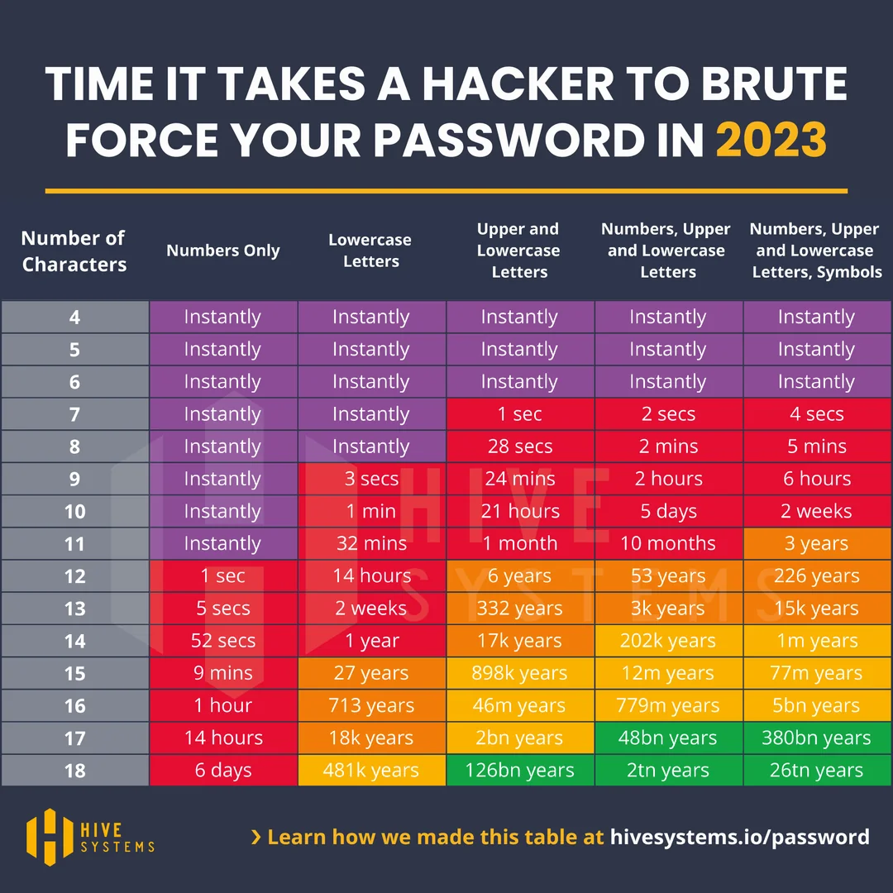

# GLOSSAIRE

- [Général](#général)
- [Front-end](#front-end)
- [UX / UI](#ux-ui)
- [Architecture](#architecture)
- [Modélisation / Base de données](#modélisation---base-de-données)
- [Symfony](#symfony)
- [Sécurité](#sécurité)
- [RGPD](#rgpd)
- [SEO](#seo)
- [Gestion de projets / DevOps](#gestion-de-projets---devops)
- [English](#english)

## Général

1. Quel est l’environnement à installer pour exécuter un script PHP ? Citer 2 exemples de logiciels permettant ce contexte

   - Le package Laragon permet d'executer des scripts PHP.

2. Qu’est-ce qu’un algorithme ?

   - Une suite d'instructions à effectuer dans un ordre précis.

3. Qu’est-ce qu’une variable ? Par quel symbole est préfixée une variable en PHP ?

   - Une valeur affectée à [un mot?]. Elle peut être de plusieurs types (string, int, bool).
     Sur PHP une variable est préfixée de '$'.

4. Qu’est-ce que la portée d’une variable ?

   - Cela indique si elle est accessible en dehors du bloc dans lequel elle a été déclarée. Cela dépend de comment elle a été déclarée, de sa position et de sa portée.

5. Qu’est-ce qu’une constante ? Quelle est la différence avec une variable ?

   - Tout comme une variable une constante est une valeur associée à un libellé, sauf qu'elle ne peut pas changer de valeur, d'où son nom.

6. Qu’est-ce qu’une superglobale, combien en existent-ils et donner un exemple d’utilisation

   - C'est une variable qui est toujours accessible. Il en existe 9 ($\_SERVER, $\_GET, $\_POST, $\_FILES, $\_COOKIE, $\_SESSION, $\_ENV, $\_REQUEST, $\_GLOBALS). (ex: $\_POST pour retrouver le contenu d'un post)

7. Quels sont les différents types (primitifs) que l’on peut associer à une variable en PHP ? Les citer et en donner des exemples (ne pas oublier le type d’une variable sans valeur)

   - string (chaîne de charactères)
   - int (nombre entier)
   - float (nombre décimal)
   - char (charactère)
   - bool (vrai/faux)
   - null (rien)

8. Existe-t-il plusieurs types de tableaux en PHP, si oui lesquels ?

   - Il y a les tableaux simples, avec seulement des valeurs:
     ```php
     array(10, 12, 8)
     ```
   - Et les tableaux associant une valeur à une clé:
     ```php
     array => ["Mickaël" => "FRA", "Virgile" => "ESP"];
     ```

9. Quelles sont les différentes structures de contrôles qu’il existe en algorithmie ? Donner un exemple pour chacune d’entre elles

   - Séquences : (bloc de code?)
   - Sélections :
     ```php
     if($condition) {
         // action
     }
     ```
   - Répétitions :
     ```php
     while($condition) {
         // action
     }
     ```
   - Alternatives
     ```php
     switch($valeur) {
         case 0:
             echo "!!";
             break;
         case 1:
             echo "??";
             break;
         default:
             echo "!?"
     }
     ```
   - Boucles
     ```php
     for($i = 0; $i < 10; i++) {
         // action
     }
     ```

10. Quelle est la fonction PHP permettant de demander la longueur d’une chaîne de caractères ?

    - strlen($array)

11. Qu’est-ce qu’une session ? Quelle fonction permet de démarrer une session en PHP ? Donner un exemple d’utilisation en PHP

    - session_start() permet de démarrer une session en PHP
    - créer un site d'achat avec un panier dans lequel les achats seraient stockés dans $\_SESSION

12. Qu’est-ce qu’un cookie ? Donner un exemple d’utilisation en PHP

    - Un cookie est un petit fichier stocké sur le navigateur de l'utilisateur pour conserver des données entre les sessions.
      ex: setcookie("user", "Alice", time() + 3600);

13. Quelle est la différence entre les instructions « require » et « include » en PHP

    - If the target file isn't specified, require generates a fatal error that stops the script, while include generates a warning but lets the "script" continue

14. Comment effectuer une redirection en PHP ?

    - header("Location: location/path.php")

15. Définir la partie « front-end » et « back-end » d’une application

    - Le front-end c'est ce que l'utilisateur voit, comme le site
    - Le back-end c'est par exemple l'enregistrement des utilisateurs.

16. Définir le contrôle de version ? Qu’est-ce que Git ?

    - Le suivi des changement apportés à un fichier ou un ensemble de fichiers (ex: liste des commits sur un repo Github).
    - Git: Système de contrôle de version lancé par Linus Torvalds en 2005. [lore](https://github.com/git/git/commit/e83c5163316f89bfbde7d9ab23ca2e25604af290#diff-2b7814d3fca2e99e56c51b6ff2aa313ea6e9da6424804240aa8ad891fdfe0900)

17. Qu’est-ce qu’un CMS ? Citer au moins 2 exemples
    - Content Management System, permet de créer un site web sans connaissances particulières en développement web (ex: Wordpress, ...)

## Front-end

18. Définir HTML

    - Langage permettant de créer des sites web à partir de balises.

19. Définir CSS

    - Permet de mettre le site en page grâce à des propriétés appliquées aux balises (couleur, largeur, arrangement)

20. Définir Javascript

    - Permet plus d'interactivité grâce à l'exécution de scripts (eventListener sur un bouton HTML qui change le CSS)

21. Définir JSON. Dans quel contexte ce format est-il utilisé ?

    - JavaScript Object Notation, c'est un langage de base de données, il peut être utilisé dans de nombreuses situations qui nécessitent une base de données (genre les naissances à l'hôpital, avec nom, prénom, et date de naissance pour chaque personne)

22. Peut-on interpréter du Javascript côté serveur ? Si oui, comment ?

    - Oui c'est possible. Node.js rend ça possible.

23. Qu’est-ce qu’un sélecteur CSS ?

    - Une classe(ex: .box) ou un id(ex: #container) ou une balise(ex: header)

24. Quelle balise HTML permet de créer un lien hypertexte ?

    - &lt;a href="[LIEN]"&gt;[TEXTE DU LIEN]&lt;/a&gt;

25. Qu’est-ce qu’une requête AJAX ?

    - AJAX: Asynchronous JavaScript and XML => Déf web: méthode de communication entre un navigateur web et un serveur web qui permet de récupérer des données dynamiques sans recharger complètement la page web

26. Quel sélecteur CSS permet de sélectionner tous les éléments d’une classe spécifique ? D’un identifiant spécifique ?

    - ul > : sélectionne les enfants de ul
    - ul > li : sélectionne tous les li enfants de ul

27. Définir le responsive design

    - Le fait que la disposition et la taille des éléments s'adapte au format de l'appareil (pc, téléphone)

28. Qu’est-ce que le templating ?

    - Le fait d'avoir une template, c'est-à-dire un bout de code qui sera répêté partout et évitera les répétitions (ex: ob_start() et ob_get_clean() permettent d'"enregistrer" le contenu pour le répêter autre part)

29. Qu’est-ce qu’une fonction anonyme en Javascript ?

    - fonction sans nom (ex: const addFunc = (a, b) => a + b;)

30. Quelle méthode JavaScript est utilisée pour ajouter un élément à la fin d'un tableau ?

    - yourArray.push(eltToPush)

31. Qu’est-ce qu’un « media query » ?

    - Sert en CSS pour le responsive design. Permet de changer le CSS de tel ou tel élément en fonction de la taille du viewport.

32. Qu’est-ce qu’un pseudo élément en CSS ?

    - déf web: élément virtuel qui est ajouté à un sélecteur CSS pour styliser une partie spécifique d’un élément HTML
      - ::before => [crée un pseudo-élément qui sera le premier enfant de l'élément ciblé](https://developer.mozilla.org/fr/docs/Web/CSS/::before)
      - ::after => [crée un pseudo-élément qui sera le dernier enfant de l'élément sélectionné](https://developer.mozilla.org/fr/docs/Web/CSS/::after)
      - ::first-line => [styliser la première ligne d'un bloc de texte](https://developer.mozilla.org/fr/docs/Web/CSS/::first-line)
      - ::first-letter => [styliser la première lettre d'un bloc de texte](https://developer.mozilla.org/fr/docs/Web/CSS/::first-letter)

33. Qu’est-ce que Bootstrap ? Donner d’autres exemples équivalent

    - Framework CSS qui facilite la mise en page
    - Tailwind CSS est aussi un framework CSS qui facilite la mise en style

34. Quand un formulaire HTML est créé, quelles sont les 2 méthodes qui peuvent lui être associées ? Donner la différence entre ces 2 méthodes
    - action="post" et action="??"

## UX UI

35. Quelle est la différence entre UX Design et UI Design ?

    - UX: user experience
    - UI: user interface
    - En général une bonne expérience utilisateur passe par une bonne interface utilisateur, qui se doit d'être agréable à l'oeil tout en restant intuitive à utiliser

36. Qu’est-ce qu’un wireframe ?

    - C'est le "squelette" d'un site, ce n'est pas une maquette complète, mais plutôt une maquette qui désigne l'emplacement des éléments (taille, agencement, ...) sans trop s'attarder sur le style (couleur, police d'écriture, ...)

37. Qu’est-ce qu’un prototype ?

    - Un prototype en UX/UI est une version interactive ou statique d'une interface destinée à tester et valider des idées de design. Il
permet de simuler l'expérience utilisateur avant le développement final.

38. Qu’est-ce que la hiérarchie visuelle en UI Design ?

    - La hiérarchie visuelle en UI Design organise les éléments d'une interface pour guider l’attention de l’utilisateur. Elle utilise la taille, la couleur, l’espacement et la disposition pour prioriser l'information.

39. Qu’est-ce que l’accessibilité en UX Design ?

    - C'est le fait de prendre à garde à ce que tout le site soit utilisable et compréensible par tout le monde, quels que puissent être leurs handicaps (daltonisme, ?malvoiyance?).
    - Il faut donc faire attention à, par exemple, rendre la couleur du texte facile à lire par rapport à l'arrière plan

40. Qu’est-ce qu’une grille de mise en page ?

    - Une grille de mise en page est un système de lignes verticales et horizontales qui structure et aligne les éléments d’une interface. Elle aide à créer de la cohérence, de l’équilibre et une bonne lisibilité.

41. Qu’est-ce que la notion d’affordance en UX Design ?

    - Le fait de suggérer des actions à l'utilisateur sans qu'il ait besoin de comprendre le fonctionnement du site (ex: changement de curseur au survol, contraste)
    - Contribue à l'UX dans la mesure où même un utilisateur nouveau pourra utiliser le site normalement

42. Qu’est-ce qu’un « mobile first design » ?
    - Le fait de commencer la maquette sur un format mobile, afin de s'assurer que les éléments ne sont pas envahissants, contrairement au desktop first, qui pourrait forcer à faire des compromis

## Programmation orientée objet (POO)

43. Donner une définition de la programmation orientée objet

    - Programmation qui utilise des classes et des objets avec héritage et tout, ce qui permet d'éviter la redondance

44. Qu’est-ce qu’une classe ? Comment la déclare-t-on ?

    - Ensemble d'attributs (ex: prix, modèle) et de fonctions (ex: addPrice(int $price)) qui permettent d'instancier un objet possédant ces attributs et fonctions
    - class Name{...contenu...}

45. Qu’est-ce qu’un objet ?

    - Instance d'une classe (ex: Student $student Ici $student est une instance de la classe Student et possède toutes ses attributs et fonctions)

46. Définir la notion de propriété / attribut / méthode

    - propriété: zz
    - attribut: les caractéristiques d'un objet
      Exemple:
      ```php
      private $nom;
      private $prix;
      private $kilometrage = 0;
      ```
    - Méthode: Une fonction
      Exemple:
      ```php
      public function addPrice(int $price): void
      {
          $this->price += $price;
      }
      ```

47. Qu’est-ce que la visibilité d’une propriété ou d’une méthode ? Citer les différents types de visibilité

    - Cela définit son accessibilité
    - public: accessibles à l'intérieur et à l'extérieur de la classe
    - private: accessibles à l'intérieur de la classe uniquement
    - protected: accessibles à l'intérieur de la classe uniquement ou à l'extérieur grâce à une méthode dérivée
      Exemple:
      ```php
      public function callProtected() {
          $this->protectedMethod();
      }
      ```

48. Quelle est la méthode spécifique utilisée pour créer un nouvel objet à partir d’une classe ?

    - $var = new NomObjet(paramètres);
      Exemple:
      ```php
      $auteur = new Auteur("Stephen King", "1247-09-21");
      ```
      Dans ce cas-là, la classe auteur contient un constructeur qui requiert deux paramètres: des strings correspondant aux attributs $nom et $dateNaissance

49. Qu’est-ce que l’encapsulation ?

    - Déf: regroupement des méthodes et attributs dans une même classe.

50. Que signifie « étendre une classe » ? Quelle est le concept clé mis en œuvre ? Donner un exemple

    - Étendre une classe, c'est le fait de la réutiliser pour une autre classe, par héritage
    - L'héritage permet de réutiliser des méthodes de la classe mère <br>
      Exemple:
      ```php
      class Enemy extends NPC {
          // contenu de la classe
      }
      ```

51. ## Définir l’opérateur de résolution de portée

    - L’opérateur de résolution de portée (::) en POO permet d’accéder à des membres statiques, des constantes ou des méthodes d’une classe sans instancier celle-ci. ex: MaClasse::MA_CONSTANTE.

53. Définir une méthode / propriété statique

    - public static function functionName(){}
    - private static string $\_name;

54. Définir le polymorphisme en POO

    - Permet de définir plusieurs versions d'une méthode, pour remplir des buts différents

55. Définir une méthode / classe abstraite ?

    - Une classe plus générale qui est parente d'autres classes dans lesquelles ses méthodes seront implémentées.

56. Définir le chaînage de méthodes

    - Permet d'accéder à des infos pas disponibles directement
      Exemple:

      ```php
      // Dans ce cas-là, l'attribut $voiture de User est de type Voiture, c-à-d que c'est une instance d'un autre objet, qui possède un getter pour son attribut $nom

      $user = new User;

      $nomVoitureUser = $user->getVoiture()->getNom();
      ```

57. Qu’est-ce que la méthode \_\_toString() ? Existe-t-il d’autres méthodes « magiques »

    - C'est une méthode qui renvoie ce qu'on lui demande de renvoyer pour éviter les redondances
      Exemple:
      ```php
      public function __toString() {
          return($this->prenom . " " . $this->nom);
      }
      ```
      Et alors il sera préférable d'appeler le \_\_toString que de concaténer $prenom et $nomplein de fois

58. Qu’est-ce qu’un « autoload » ?

    - Un autoload permet de charger automatiquement les classes PHP quand elles sont utilisées, sans avoir à faire de require manuel. Il facilite la gestion et l’organisation du code, surtout avec des namespaces.

59. Comment appelle-t-on en français les « getters » et les « setters » ?

    - accesseur? Permet de mettre à jour une valeur ou d'aller la chercher.

60. ## Qu’est-ce que la sérialisation en PHP ?

    - La sérialisation en PHP convertit une variable (comme un objet ou un tableau) en une chaîne de caractères. Cela permet de la stocker ou la transmettre facilement, puis de la restaurer avec unserialize().

## Architecture

60. Qu’est-ce que l’architecture client / serveur ? Grâce à quel type de requête peut-on interroger le serveur. Définir l’acronyme de ce type de requête. Si on ajoute un « S » à cet acronyme, expliquer la différence

- L’architecture client/serveur sépare les rôles : le client envoie des requêtes, le serveur y répond.
On interroge le serveur via des requêtes HTTP (HyperText Transfer Protocol).
Avec un « S » (HTTPS), les échanges sont sécurisés grâce au chiffrement SSL/TLS.

61. Donner la définition d’un design pattern. Citer au moins 3 exemples de design pattern

- Un design pattern est une solution réutilisable à un problème courant de conception logicielle.
Exemples : Singleton, Observer, Factory.

62. Qu’est-ce que l’architecture MVC ?

    - MVC : Model - View - Controller

63. Quel est le rôle de chaque couche du design pattern MVC : Model, View, Controller ?

    - Model: Gestion de la connexion à la BDD et manipulation des données
    - View: Affichage des données sélectionnées
    - Controller: Lien entre Model et View, permet d'envoyer des requêtes spécifiques à Model, puis de sélectionner les données à envoyer à View

64. Quels sont les avantages de l’architecture MVC ?

    - L’architecture MVC sépare les responsabilités (Modèle, Vue, Contrôleur), facilitant la maintenance et les tests. Elle améliore aussi la réutilisabilité et la collaboration entre développeurs et designers.

65. Existe-t-il des variantes à l’architecture MVC ?

    - Oui, il existe des variantes comme MVVM (Model-View-ViewModel), MVP (Model-View-Presenter), et MVU (Model-View-Update), chacune adaptée à différents types d'applications et frameworks.

66. Qu’est-ce qu’une API ? Définir l’architecture REST
    
    - API: Application Programming Interface, en français interface de programmation d'application, sert à créer un lien (interface) en une BDD et l'utilisateur, peut fournir des actions (ex: shuffle() dans une API de jeu de carte)
    - API REST:

## Modélisation - Base de données

67. Qu’est-ce que la modélisation de données ? Définir la méthode Merise

    - La modélisation de données est le fait de définir toutes les données nécessaires, leurs attributs et les liens entre eux afin de faciliter la création de la BDD/des Entity
    - Méthode Merise: Conceptualisation de la modélisation des données de telle sorte à rendre la communication entre le client et le programmeur plus facile, de par l'utilisation de verbes et de mots pour représenter les données (prose)

68. Quelles sont les 3 étapes principales de la méthode Merise ?
    
    a. Analyse, conception et réalisation
    b. Planification, exécution et contrôle
    c. Création, modification et suppression
    
70. Qu’est-ce qu’un modèle conceptuel de données (MCD) en Merise ?

- Un modèle conceptuel de données (MCD) en Merise est une représentation graphique des données et de leurs relations dans un système, sans tenir compte des aspects techniques. Il sert à définir la structure de la base de données de manière abstraite.
    
72. Qu’est-ce qu’un modèle logique de données (MLD) en Merise ?

- Le modèle logique de données (MLD) en Merise est une traduction du MCD en termes techniques, en vue de la création d’une base de données relationnelle. Il précise les tables, les clés primaires et les relations entre les entités.

73. Donner la définition des mots suivants : <br>

    a. Entité: ... <br>
    b. Relation: ... <br>
    c. Cardinalité: ... <br>
    d. Clé primaire / clé étrangère: elt unique de l'entité qui permet de l'identifier / id d'une autre entité, qui fait le lien entre les deux entités
    
75. Que devient une relation de type « Many To Many » dans le modèle logique de données ?
    
    - Elle génère une entité entre les deux entités, contenant au moins leurs clés, afin de les lier
      
77. Qu’est-ce qu’une base de données ?

    - Stockage des données des différentes entités, qui permet un accès et stockage

78. Définir les notions suivantes :
    
    a. SQL: Structured Query Language, peut effectuer des recherches spécifiques dans les BDD
    b. MySQL: Système de hestion de BDD, basé sur SQL
    c. SGBD (donner 2 exemples de SGBD):
    
80. Dans une base de données, les données sont stockées dans des **_. Celles-ci sont constituées de lignes appelées _** et de colonnes appelées \_\_\_
    
82. Quelle est la différence entre une base de données relationnelle et non relationnelle ?
    
    - Une base de données relationnelle utilise des tables avec des relations structurées entre elles, tandis qu'une base de données non relationnelle (NoSQL) stocke des données de manière plus flexible, souvent sous forme de documents, de paires clé-valeur ou de graphes.
      
84. Qu’est-ce qu’une jointure dans une base de données ? En existe-t-il plusieurs ? Si oui lesquelles ?
    
    - Une jointure dans une base de données permet de combiner des données de plusieurs tables en fonction d'une condition commune.
Il en existe plusieurs types : INNER JOIN, LEFT JOIN, RIGHT JOIN, et FULL JOIN.

86. A quoi sert une vue dans une base de données ?

- Une vue dans une base de données est une requête enregistrée qui permet d'afficher des données issues de plusieurs tables, sans modifier la structure de la base. Elle simplifie l'accès aux informations complexes et sécurise les données sensibles.

87. Qu’est-ce que l’intégrité référentielle dans une base de données ?

- L'intégrité référentielle garantit que les relations entre les tables restent cohérentes, en assurant que les clés étrangères pointent vers des enregistrements valides dans les tables référencées. Elle empêche la suppression ou la modification de données liées de manière invalide.

88. Quelles sont les fonctions d’agrégation en SQL ?

- Les fonctions d'agrégation en SQL permettent de calculer des valeurs résumées sur un ensemble de données. Les principales sont : COUNT(), SUM(), AVG(), MIN(), et MAX().

89. Qu’est-ce qu’un CRUD dans le contexte d’une base de données ?

- Un CRUD représente les quatre opérations de base pour manipuler les données dans une base de données : Create (ajouter), Read (lire), Update (mettre à jour), et Delete (supprimer).

90. Quelles sont les clauses qui permettent de :

    a. Insérer un nouvel enregistrement dans une table
    b. Modifier un enregistrement dans une table
    c. Supprimer un enregistrement dans une table
    d. Supprimer la base de données
    e. Filtrer les résultats d’une requête SQL
    f. Trier les résultats d’une requête SELECT
    g. Regrouper les résultats d'une requête SELECT en fonction d'une colonne spécifique
    h. Concaténer 2 chaînes de caractères

92. Comment se connecter à une base de données en PHP ? Quelle est la classe native utilisée ?

- En PHP, on se connecte à une base de données avec la classe native PDO (PHP Data Objects). Exemple de connexion :
  ```php
   <?php
   // Se connecter à la base de données
   $pdo = new PDO('mysql:host=localhost;dbname=ma_base', 'utilisateur', 'motdepasse');
   
   // Vérifier la connexion
   if ($pdo) {
       echo "Connexion réussie!";
   } else {
       echo "Échec de la connexion!";
   }
   ?>
   ```

## Symfony

84. Qu’est-ce que Symfony ?

- Symfony est un framework PHP open-source pour le développement d'applications web. Il fournit des outils et des composants réutilisables, permettant de créer des applications robustes et évolutives en suivant les bonnes pratiques de développement.

85. Sur quel langage de programmation et design pattern repose Symfony ?

- Symfony repose sur le langage de programmation PHP et utilise principalement le design pattern MVC (Model-View-Controller) pour structurer les applications web. Il fait également usage de nombreux autres design patterns, comme Dependency Injection et Event Dispatcher.

86. Quelle est la dernière version en date de Symfony ?

- ​La dernière version stable de Symfony est la 7.2, publiée en novembre 2024. Elle est actuellement maintenue et nécessite PHP 8.2 ou une version supérieure. La version 7.2.4, la plus récente en date, a été publiée en février 2025.

87. Qu’est-ce qu’un bundle ?

- Un bundle dans Symfony est un ensemble de fonctionnalités ou de composants réutilisables qui peuvent être intégrés dans une application Symfony. Il contient généralement des contrôleurs, des services, des configurations, des vues et des ressources pour ajouter une fonctionnalité spécifique à l'application, comme la gestion des utilisateurs ou l'intégration de services tiers.

88. Quel est le moteur de template utilisé par défaut dans Symfony ?

- Le moteur de template utilisé par défaut dans Symfony est Twig. C'est un moteur de template flexible et sécurisé, qui permet de séparer la logique de présentation du code PHP.

89. Qu’est-ce qu’un ORM ? Quel est son utilité et comment s’appelle-t-il au sein de Symfony ?

- Un ORM (Object-Relational Mapping) est une technique qui permet de mapper des objets en langage de programmation orienté objet avec des tables de base de données relationnelle. Son utilité est de simplifier l'interaction avec la base de données en manipulant des objets plutôt que des requêtes SQL.

Dans Symfony, l'ORM utilisé par défaut est Doctrine. Il permet de gérer facilement les entités (objets) et leurs relations avec les tables de la base de données.

90. Qu’est-ce que l’injection de dépendances ? Quel est l’outil utilisé dans ce contexte et quel fichier contient l’intégralité des dépendances du projet ?

- L'injection de dépendances permet de fournir des services à une classe au lieu de les créer à l'intérieur. Dans Symfony, cela se fait via le Service Container, et les dépendances sont configurées principalement dans le fichier services.yaml.

91. Que permet le bundle Maker au sein de Symfony ?

- Le bundle Maker dans Symfony permet de générer rapidement des classes, des contrôleurs, des formulaires, des entités, etc., en utilisant des commandes en ligne. Cela facilite le développement en automatisant la création de code de base.

92. Quel est le langage de requêtage exploité au sein d’un projet Symfony ?

- Le langage de requêtage utilisé au sein d'un projet Symfony est DQL (Doctrine Query Language), qui est propre à Doctrine ORM. DQL permet de rédiger des requêtes orientées objet pour interagir avec la base de données de manière abstraite.

93. Quel est le composant qui garantit l’authentification et l’autorisation des utilisateurs ?

- Le composant qui garantit l'authentification et l'autorisation des utilisateurs dans Symfony est Security. Il gère les mécanismes de sécurité, comme l'authentification, la gestion des rôles et des permissions des utilisateurs.

## Sécurité

94. Qu’est-ce que l’injection SQL ? Comment s’en prémunir ?

    - Le fait d'écrire du SQL dans une zone de texte mal sécurisée pour récupérer des infos non accessibles normalement
    - ex: (SELECT email, password FROM users)
    - ex: ('1=1' & SELECT...)
    - Comment s'en prévenir: Utiliser des requêtes pré-faites sauvegardées en fonctions pour empêcher leur accès aux utilisateurs

96. Qu’est-ce que la faille XSS ? Comment s’en prémunir ?

    - XSS: Cross Site Scripting, le fait d'éxecuter du script dans le site
    - ex: uploader un fichier en .js qui contient 'window.alert("buh")' puis y accéder par l'url
    - Comment s'en prémunir: filtrer les uploads de fichiers (que .png ou .jpeg), casser les inputs (< devient '\&lt;' et > devient '\&gt;')

97. Qu’est-ce que la faille CSRF ? Comment s’en prémunir ?

    - La faille CSRF (Cross-Site Request Forgery) permet à un attaquant d'envoyer des requêtes malveillantes au nom d'un utilisateur authentifié, en exploitant la confiance du site envers cet utilisateur.

Pour s'en prémunir, Symfony utilise un token CSRF dans les formulaires. Ce token est un identifiant unique qui doit être validé à chaque soumission de formulaire pour s'assurer que la requête provient bien de l'utilisateur légitime.

98. Définir l’attaque par force brute et l’attaque par dictionnaire

- L'attaque par force brute consiste à essayer toutes les combinaisons possibles de mots de passe jusqu'à trouver le bon. Elle est généralement lente et nécessite de nombreuses tentatives.

L'attaque par dictionnaire utilise une liste précompilée de mots courants ou de mots de passe fréquemment utilisés pour tenter de deviner un mot de passe, étant plus rapide que l'attaque par force brute mais moins exhaustive.

99. Existe-t-il d’autres failles de sécurité ? Citer celles-ci et expliquer simplement leur comportement

- Oui, il existe plusieurs autres failles de sécurité, parmi lesquelles :

Injection SQL : L'attaquant insère du code SQL malveillant dans une requête pour manipuler la base de données, voler ou supprimer des données.

XSS (Cross-Site Scripting) : L'attaquant injecte du code JavaScript malveillant dans une page web visitée par d'autres utilisateurs, permettant de voler des informations ou d'exécuter des actions non autorisées.

Inclusion de fichier distant (RFI) : L'attaquant exploite une vulnérabilité pour inclure un fichier distant malveillant dans une application, compromettant ainsi la sécurité du serveur.

Réutilisation de session (Session Hijacking) : L'attaquant vole un identifiant de session valide pour usurper l'identité d'un utilisateur et accéder à ses informations privées.

Man-in-the-middle (MITM) : L'attaquant intercepte et potentiellement modifie les communications entre un client et un serveur, souvent pour voler des informations sensibles.

Chacune de ces failles peut être évitée par des bonnes pratiques de codage, des mécanismes de validation des données, ainsi que des protocoles de sécurité comme HTTPS.

100. A quoi servent l’authentification et l’autorisation dans un contexte d’application web ?

- L'authentification permet de vérifier l'identité d'un utilisateur, généralement via un nom d'utilisateur et un mot de passe, pour s'assurer qu'il est bien celui qu'il prétend être.
L'autorisation détermine les actions ou ressources auxquelles l'utilisateur authentifié a accès, en fonction de ses rôles ou permissions.

101.  Définir la notion de hachage d’un mot de passe et citer des algorithmes de hachage

- Le hachage d'un mot de passe est un procédé qui transforme le mot de passe en une valeur fixe de longueur déterminée, généralement sous forme de chaîne de caractères, de manière irréversible. Cela permet de stocker de manière sécurisée le mot de passe sans le conserver en clair.

Des exemples d'algorithmes de hachage sont
- SHA256
- bcrypt
- Argon2

102.  Qu’est-ce qu’une politique de mots de passe forts ?

     - Au moins 12 caractères, des minuscules, des majuscules, des chiffres et des caractères spéciaux </br>
      

106.  Qu’est-ce que l’hameçonnage ?

     - L'envoi d'un lien (ex: par mail) renvoyant vers une page, un logiciel récupérant les infos de l'utilisateur

103. Définir la « validation des entrées »

- La validation des entrées consiste à vérifier que les données reçues d'un utilisateur ou d'une source externe respectent un format, une structure et des critères définis avant d'être utilisées par l'application. Cela permet de prévenir les erreurs, les attaques (comme les injections) et d'assurer l'intégrité des données traitées.

## RGPD

104. Qu’est-ce que le RGPD ?

     - Règlement Général de la Protection des Données
     - Règlement de l'Union européenne en matière de protection des données personnelles

105. Quel est son objectif principal ?

     - Protéger les données privées des utilisateurs
     - Renforcer les droits des citoyens
     - Uniformiser de la réglementation en UE
     - Responsabiliser les entreprises

106. Quelle est la date d’entrée en vigueur du RGPD ?

     - 25 mai 2018

107. Quelles sont les sanctions possibles en cas de non-respect du RGPD ?

     - Jusqu’à 10 millions d’euros ou 2% du chiffre d’affaires mondial pour des manquements relatifs à la mise en conformité.
     - Jusqu’à 20 millions d’euros ou 4% du chiffre d’affaires mondial pour des manquements relatifs aux droits des personnes.
     - Mais il existe également des sanctions pénales prévues par le Code pénal en France. En voici quelques exemples :
       - Absence d’information des personnes concernées : Il s’agit du cas où, au moment de la collecte des données, vous n’informez pas la personne concernée de cette collecte. Par exemple, lors de la prospection commerciale, il faut informer la personne concernée que vous collectez ses données personnelles. En cas de non-respect de cette obligation, l’entreprise s’expose à une amende de 1 500€ pour chaque infraction.
       - Non-respect des droits des personnes : C’est le cas lorsque l’entreprise qui collecte des données ne répond pas à une personne qui demande la rectification de ses données personnelles ou l’effacement de celles-ci. De même, l’entreprise risque une amende de 1 500€ pour chaque infraction.
       - Détournement de la finalité des données personnelles : un tel détournement a lieu lorsque l’entreprise collectant les données des personnes pour un objectif précis (par exemple la fidéliser des clients) et emploie également ces données pour une autre finalité (études statistiques). Les sanctions pénales auxquelles s’expose l’entreprise sont de 5 ans d’emprisonnement et 300 000 € d’amende.

108. En France, quel est l’autorité administrative qui s’occupe de faire appliquer le RGPD ?

     - La Commission Nationale de l’Informatique et des Libertés (CNIL)

109. Quel est le consentement valide selon le RPGD ?

- Le consentement valide selon le RGPD doit être donné de manière libre, spécifique, éclairée et univoque, généralement par une action affirmative. Il doit aussi être rétractable à tout moment.

110. Qu’est-ce qu’une politique de confidentialité ?

- Une politique de confidentialité est un document qui explique comment une entreprise collecte, utilise, protège et partage les données personnelles des utilisateurs. Elle informe les utilisateurs de leurs droits et des mesures de sécurité mises en place pour protéger leurs informations.

111. Quelle est la durée de conservation maximale des données personnelles selon le RGPD ?

- Il n'y a pas de valeur fixe. Selon le RGPD, les données personnelles doivent être conservées pendant une durée n'excédant pas celle nécessaire aux finalités pour lesquelles elles sont traitées. La durée exacte dépend de la nature des données et de leur utilisation, mais elle doit être justifiée par l'objectif du traitement.

112. Quels sont les droits des utilisateurs selon le RGPD ?

- Droit d'accès : Accéder aux données personnelles collectées à leur sujet.

- Droit de rectification : Corriger des données personnelles inexactes ou incomplètes.

- Droit à l'effacement (droit à l'oubli) : Demander la suppression de leurs données sous certaines conditions.

- Droit à la limitation du traitement : Restreindre le traitement de leurs données dans certains cas.

- Droit à la portabilité des données : Récupérer leurs données dans un format structuré pour les transférer à un autre service.

- Droit d'opposition : S'opposer au traitement de leurs données, notamment pour des fins de marketing direct.

- Droit de ne pas faire l'objet d'une décision automatisée : Refuser des décisions basées uniquement sur des traitements automatisés, comme le profilage.

113. Qu’est-ce que le principe de minimisation des données selon le RGPD ?

- Le principe de minimisation des données selon le RGPD stipule que seules les données personnelles nécessaires à la réalisation des objectifs du traitement doivent être collectées. Cela signifie qu'il ne faut pas collecter plus de données que ce qui est strictement nécessaire pour accomplir une tâche spécifique.

## SEO

114. Qu’est-ce que le SEO ?

     - Search Engine Optimization

115. Quel est l’objectif principal du SEO ?

     - Améliorer le référencement, pour augmenter son 'rang' dans les résultats de recherche

116. Existe-t-il plusieurs types de référencement ? Lesquels ?

      - Référencement naturel (SEO): site classé en fonstion de si il est bien structuré
     - Référencement payant (SEA): visibilité accrue en payant (sur Google l'intitulé 'Sponsorisé')
     - Référencement social (SMO): visibilité accrue par la présence sur les réseaux sociaux
     - Référencement mobile (SMA): visibilité accrue en fonction de si le site est responsive pour mobile

118. Qu’est-ce que la densité de mots-clés en SEO ?

     - Le nombre d'occurences d'un mot par rapport au nombre total de mots
     - Une densité de mots clés située entre 1% et 4% est jugée acceptable, en dessous trop peu et au dessus du bourrage

119. Qu’est-ce qu’une balise « alt » ?

     - C'est une balise qui permet d'ajouter une description, notamment à une image, ce qui rendra le site plus accessible aux personnes malvoyantes qui utiliseraient des narrateurs d'écran

120. Qu’est-ce que la balise « meta description » ?

     - Elle se situe dans la tête de page et permet de fournir une description fournie mais concise du contenu de la page actuelle

121. Qu’est-ce que le « nofollow » en SEO ?

     - C'est un lien possédant l'attribut rel=nofollow qui indique aux robots de référencement de ne pas suivre ce lien
     - Empêche les liens sortants de distribuer du SEO aux sites de destination

122. Quelle est l'importance du contenu de qualité pour le référencement d'un site web ?

     - Le contenu de qualité est essentiel pour le référencement (SEO) d'un site web car il améliore l'expérience utilisateur, favorise l'engagement et augmente la probabilité que le site soit bien classé par les moteurs de recherche. Un contenu pertinent, bien structuré et optimisé pour des mots-clés spécifiques permet d'attirer davantage de visiteurs et d'améliorer la visibilité du site.

123. Pourquoi est-il important d'utiliser des balises de titre (h1, h2, h3, etc.) de manière structurée ?

     - Car les titres sont utilisés dans le SEO, mieux vaut mettre "Site de recettes de cuisine" en &lt;h1&gt; que "Ingrédients: ", car le site sera mieux référencé en tant que site de cuisine

124. Quelle est la recommandation pour les URL d'un site web bien référencé ?

- Pour un site web bien référencé, les URL doivent être courtes, descriptives, et contenir des mots-clés pertinents. Elles doivent être facilement compréhensibles par les utilisateurs et les moteurs de recherche, en utilisant des tirets pour séparer les mots (plutôt que des underscores) et éviter les caractères spéciaux ou les paramètres complexes.

125. Qu'est-ce que le maillage interne et pourquoi est-il important pour le référencement ?

- Le maillage interne consiste à relier les pages d'un même site web entre elles via des liens. Il est important pour le référencement car il aide les moteurs de recherche à explorer et indexer le site plus efficacement, tout en améliorant l'expérience utilisateur en facilitant la navigation et l'accès à du contenu pertinent.

126. Qu'est-ce que l'optimisation des images pour le référencement ?

     - Privilégier des images "web friendly", comme webp ou jfif a png et jpg permet d'accélérer le chargement de la page, et par conséquent d'améliorer le "score" SEO

127. Qu'est-ce qu'un plan de site (sitemap) et pourquoi est-il important pour le référencement ?

      - Cela peut être une page du site ou bien un fichier texte, qui décrit l'architecture du site (l'agencement des pages) et qui permet d'indexer les pages, améliorant la SEO

## Gestion de projets - DevOps

127. Qu’est-ce que la gestion de projet ?

- La gestion de projet consiste à planifier, organiser, diriger et contrôler les ressources et les activités pour atteindre les objectifs d'un projet dans les délais, le budget et la qualité définis. Cela inclut la gestion des risques, des parties prenantes, et des contraintes pour garantir la réussite du projet.

128. Qu’est-ce qu’une méthode Agile de gestion de projet ?

- La méthode Agile de gestion de projet est une approche flexible et itérative qui privilégie la collaboration, l'adaptation continue et la livraison fréquente de petites portions de produit. Elle se concentre sur l'amélioration continue, la réactivité aux changements et la satisfaction des utilisateurs finaux.

129. Expliquer la méthode MoSCoW en quelques lignes et citer ses avantages

     - Mo : Must have
     - S : Should have
     - Co : Could have
     - W : Won't have
     - Permet d'optimiser le travail en déterminant les fonctionnalités sur lesquelles travailler en premier (vues) avant le reste (style)

130. A quoi sert la méthodologie MVP ? Citer les caractéristiques clés

     - MVP : Minimum Viable Product, ce dont le site a besoin pour fonctionner, et c'est tout (rentre dans la partie Must have de la méthode MoSCoW)
     - Permet donc de déterminer le minimum nécessaire pour avoir un site fonctionnel (et même présentable, dans le cadre de notre projet de fin d'année)

131. Qu’est-ce que la planification itérative ?

- La planification itérative est une approche de gestion de projet où le travail est divisé en petites étapes (itérations) qui permettent de réévaluer et ajuster les objectifs, les priorités et les ressources à chaque cycle. Cela permet une meilleure flexibilité et réactivité face aux changements tout en livrant régulièrement des résultats tangibles.

132. Citer 3 méthodes Agiles dans le cadre d’un projet informatique

- Scrum
- Kanban
- Extreme Programming (XP)

133. Qu’est-ce qu’une réunion de revue de projet ?

- Une réunion de revue de projet est un point de contrôle où l’équipe examine les progrès réalisés, discute des défis rencontrés et ajuste les plans si nécessaire. Elle permet d'assurer que le projet reste sur la bonne voie et de s'assurer que les objectifs sont toujours alignés avec les attentes des parties prenantes.

134. Qu’est-ce qu’un livrable dans un projet ?

- Un livrable dans un projet est un produit ou résultat tangible, spécifiquement défini et mesurable, qui doit être livré à la fin d'une phase ou du projet. Cela peut être un document, un rapport, une fonctionnalité ou tout autre élément concret attendu par les parties prenantes.

135. Quels sont les 3 piliers SCRUM ? Définir chacun d’entre eux

1. Transparence : Toutes les informations importantes doivent être visibles et accessibles à tous les membres de l'équipe et parties prenantes. Cela garantit une compréhension commune du travail effectué et des problèmes rencontrés.

2. Inspection : L'équipe doit régulièrement examiner le travail effectué et les processus pour identifier les éventuels écarts par rapport aux objectifs et apporter les ajustements nécessaires.

3. Adaptation : En fonction des résultats des inspections, l'équipe ajuste ses méthodes, ses priorités ou ses processus pour améliorer continuellement la qualité et l'efficacité du projet.


136. Qu’est-ce que le DevOps et quel est son objectif principal ?

- Le DevOps est une approche qui vise à intégrer les équipes de développement (Dev) et d'exploitation (Ops) pour améliorer la collaboration, l'automatisation et la livraison continue des logiciels. Son objectif principal est d'accélérer le cycle de développement tout en garantissant la qualité, la fiabilité et la rapidité des mises en production.

137. Qu’est-ce que l’intégration continue ?

- L'intégration continue (CI) est une pratique de développement où les développeurs intègrent régulièrement leur code dans un dépôt partagé, souvent plusieurs fois par jour. Cela permet de détecter rapidement les erreurs, d'automatiser les tests et d'assurer la qualité du code tout au long du processus de développement.

138. Qu’est-ce que Docker ? Et en quoi est-il utile dans le cadre du DevOps ?

- Docker est une plateforme qui permet de déployer des applications dans des conteneurs, garantissant une exécution cohérente sur différents environnements. Dans le cadre du DevOps, il facilite l'intégration continue et la livraison continue en assurant la portabilité et la standardisation des environnements de développement et de production.

139. Qu’est-ce qu’un test unitaire ?

- Un test unitaire est un type de test logiciel qui vérifie le bon fonctionnement d'une petite unité de code, généralement une fonction ou une méthode, de manière isolée. L'objectif est de s'assurer que chaque composant fonctionne comme prévu, indépendamment des autres parties du système.

140. Quelle est l'unité de code testée lors d'un test unitaire ?

- L'unité de code testée lors d'un test unitaire est généralement une fonction ou une méthode. C'est la plus petite partie du code qui peut être testée de manière indépendante pour vérifier qu'elle se comporte comme attendu.

141. Quelles sont les caractéristiques d'un bon test unitaire ?

1. Indépendant : Chaque test doit être isolé, ne dépendre d'aucun autre test et pouvoir être exécuté séparément.
2. Rapide : Le test doit être exécuté rapidement pour ne pas ralentir le cycle de développement.
3. Prédictible : Le résultat du test doit être le même à chaque exécution, dans les mêmes conditions.
4. Couvrant : Il doit tester toutes les situations possibles, y compris les cas limites et les erreurs.
5. Lisible : Le test doit être facile à comprendre et à maintenir.

142. Qu'est-ce qu'une assertion dans un test unitaire ?

- Une assertion dans un test unitaire est une vérification qui compare le résultat obtenu d'un morceau de code avec le résultat attendu. Si l'assertion échoue, le test unitaire est considéré comme défaillant, indiquant que le comportement du code testé ne correspond pas à ce qui était prévu.

## English

1. What does JavaScript enable you to do on a website ?
   - <strong>Add interactive behavior and dynamic content</strong>
   - Define the layout and design of web pages
   - Handle server-side operations
2. Which programming language is primarily used for server-side web development ?
   - <strong>PHP</strong>
   - JavaScript
   - HTML
3. What is the purpose of a web browser ?
   - <strong>To render and display web pages</strong>
   - To execute serve-side code
   - To manage databases
4. What is the difference between GET and POST methods in HTTP ?
   - <strong>GET retrieves data from a server, while POST submits data to a server</strong>
   - GET submits data to a server, while POST retrieves data from a server
   - GET and POST methods are interchangeable
5. What is the purpose of version control systems (e.g., Git) in web development ?
   - <strong>To track changes and manage collaborative development</strong>
   - To optimize website loading speed
   - To handle server-side scripting
6. What is the purpose of a framework in web development ?
   - To provide a structured environment for building web applications
   - <strong>To handle network protocols and data transfer</strong>
   - To create visual designs and layouts for websites
7. What does NoSQL stand for ?
   - <strong>Not Only SQL</strong>
   - Non-Structured Query Language
   - New Object-Oriented Language
8. Which of the following is a characteristic of NoSQL databases ?
   - Strict schema enforcement
   - Support for complex transaction
   - <strong>Scalability and flexible data models</strong>
